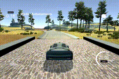

**Behavrioal Cloning Project**

Goals:
* Build, a convolution neural network in Keras that predicts steering angles from images
* Test that the model successfully drives around track one without leaving the road

[image1]: ./img/steering_dist.png "Steering distribution"
[image2]: ./img/steering_hist.png "Steering Histogram"
[image3]: ./img/img.png "Image1"
[image4]: ./img/img_adj.png "Image2"
[image5]: ./img/image_adj.png "Image3"
[image6]: ./img/steering_adj.png "Steering New Histogram"

#### Model Architecture
My first step was to use a convolution neural network architecture similar to the one provided by Nvidia. I was able to get good training and valid loss but I was not able to complete a lap on track with the trained model. Then I added max pool layers between cnn so that the model can be more focused in training. 

In order to gauge how well the model was working, I split my image and steering angle data into a training and validation set. I found that my first model had a low mean squared error on the training set but a high mean squared error on the validation set. This implied that the model was overfitting. To combat the overfitting, I modified the model to include dropouts. 

The final model architecture (model2) consists of 4 convolution neural network layers with 3x3, 2x2 filter sizes and depths of 32, 64, 128, and 128. (model.py lines 243-268). The data is normalized in the model using a Keras lambda layer (code line 250). Between cnn layers I have added RELU for nonlinearity and maxpooling to focus on neurons that mattered the most. The model contains dropout layers in order to reduce overfitting (model.py lines 259,261,263). After trying a few variations for dropout rate, I have found 0.5 to work well in mitigating bias toward going straight. 

For training, the model used an adam optimizer and have set parameters to be following: (lr=1e-4, beta_1=0.9, beta_2=0.999, epsilon=1e-08, decay=0.0). 

#### Data Exploration
##### 1. Data distribution
Initially I have used Udacity driving images for training. From browsing through Udacity data I found that there weren't not sufficient data for  the curve by dirt road after bridge. I have created my own data to supplement and also added more recovery data. 

I found that data fluctuation is quite consistent over time frame but 
![alt text][image1]

that data is highly concentrated near 0 steering angle. 

![alt text][image2]

This bias negatively affects our model in training for curves. In order to avoid the problem, I have lowered the percentage of data that has 0 steering degree and data histogram has been changed: 

![alt text][image6]

##### 2. Data Variations
I have added variations original images to account for varying brightness, shadow, and car positions. 

I have used a combination of center, right, and left images and have adjusted +- 0.22 for left and right images. 

![alt text][image3]

Then I have 1) shifted, adjusted brightness, shadowed, and flipped images. 

![alt text][image4]

Then I have resized images to be 64x64 for training.

![alt text][image5]

##### 3. Train/Valid/Test data
I finally randomly shuffled the data set and put 10% of the data into a validation set. I used this training data for training the model. The validation set helped determine if the model was over or under fitting. 

